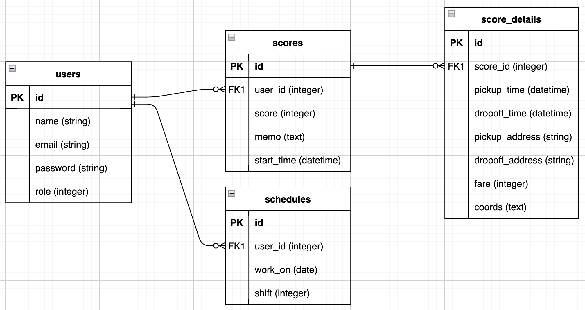

サービスへのリンク → [https://sales-calendar.net](https://sales-calendar.net)

---
## サービス概要

毎日の売上や営業、シフトを管理することができる
タクシードライバー向けのサービス

## 実装済みの機能
- 売上をカレンダー上に記録する機能
- 月度の合計売上と平均売上を自動で計算する機能
- 営業の詳細(乗降時間、乗降場所、経路、金額)を位置情報を使用して記録する機能
- 記録した経路を地図上に表示する機能
- 勤務日と勤務体系を記録し、カレンダー上に表示する機能

## 使用技術
### バックエンド
- Ruby(2.7.5)
- Ruby on Rails(6.1.4.7)
### Gem
- simple_calendar
- sorcery
- draper
- rails-i18n
- enum_help
### フロントエンド
- Javascript
- jQuery(3.6.0)
### インフラ
- PostgreSQL
- Heroku

## ER図

---
## メインのターゲットユーザー
スマートフォンを使えるタクシードライバー
## ユーザーが抱える課題
- 帰庫後に疲れている状態で売上を手帳などに記録し、手動で今月度の合計や平均を計算するのが手間、かといって班長の方に調べてもらうと作業を止めてしまうので周りのドライバーに影響が及ぶ。
- 過去の売上を見返すことができない。
- 道を覚える勉強をするために自分の通った経路を見返したいが、班長が手が空いているとき頼んでタクコンで見せてもらうしかない。(新人ドライバー)
- 営業の研究のために乗降時間や乗降場所を見返したいが、帰庫後まで見ることができない、かつその日の日報が紙で出てくるだけなので記録しておくことができない。
- お客様を降ろしてから、忘れないうちに乗降時間や乗降場所をメモしなければならないため、信号待ちや運転中にメモを取らなければならない
## 解決方法
 - カレンダー上に売上を記録する
 - 手間がかかる計算を自動化する
 - 乗降時間や乗降場所、金額、経路などを位置情報を使ってボタン一つで記録
## なぜこのサービスを作りたいのか？
 - 同僚の方たちからアプリを作ってくれという声を頂いたから。
 - 自分がタクシードライバーとして働く中で、絶対にこうゆうサービスがあったほうがいいと思っていたから。
 本来ドライバーたちが自分で把握しておくべき情報が、内勤の人にしかわからない状態になっていることでかなり効率が悪くなっているので、このサービスで改善したい。
---
## スケジュール
7月1日にリリース
